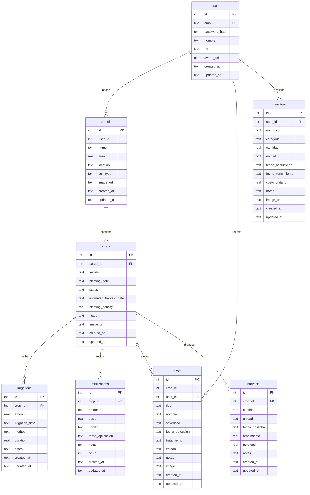

# Diagrama Entidad-Relación — AgroExec

```mermaid
erDiagram
    users ||--o{ parcels : "posee"
    users ||--o{ pests : "reporta"
    users ||--o{ inventory : "gestiona"

    parcels ||--o{ crops : "contiene"

    crops ||--o{ irrigations : "recibe"
    crops ||--o{ fertilizations : "recibe"
    crops ||--o{ pests : "afecta"
    crops ||--o{ harvests : "produce"

    users {
        int id PK
        text email UK
        text password_hash
        text nombre
        text rol
        text avatar_url
        text created_at
        text updated_at
    }

    parcels {
        int id PK
        int user_id FK
        text name
        real area
        text location
        text soil_type
        text image_url
        text created_at
        text updated_at
    }

    crops {
        int id PK
        int parcel_id FK
        text variety
        text planting_date
        text status
        text estimated_harvest_date
        real planting_density
        text notes
        text image_url
        text created_at
        text updated_at
    }

    irrigations {
        int id PK
        int crop_id FK
        real amount
        text irrigation_date
        text method
        real duration
        text notes
        text created_at
        text updated_at
    }

    fertilizations {
        int id PK
        int crop_id FK
        text producto
        real dosis
        text unidad
        text fecha_aplicacion
        text notas
        int costo
        text created_at
        text updated_at
    }

    pests {
        int id PK
        int crop_id FK
        int user_id FK
        text tipo
        text nombre
        text severidad
        text fecha_deteccion
        text tratamiento
        text estado
        text notas
        text image_url
        text created_at
        text updated_at
    }

    harvests {
        int id PK
        int crop_id FK
        real cantidad
        text unidad
        text fecha_cosecha
        real rendimiento
        real perdidas
        text notas
        text created_at
        text updated_at
    }

    inventory {
        int id PK
        int user_id FK
        text nombre
        text categoria
        real cantidad
        text unidad
        text fecha_adquisicion
        text fecha_vencimiento
        real costo_unitario
        text notas
        text image_url
        text created_at
        text updated_at
    }
```
